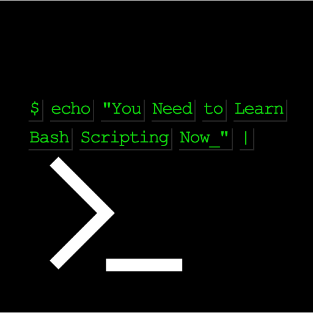

# Bash script you can learn



## Hunt down repetitive tasks and automate things with shell scripts

Did you know? Shell script is interpreted, not compiled.

### Some basic Commands-

* clear terminal texts - `clear`
* current user `hostname`
* current driectory/folder `pwd`
* find the home directory of a user `home` (doesn't work on mac)
* Current shell name
`echo $0`

 * List avaialble shells on system cat: concatenate -
 `cat /etc/shells`

 * chaneg to other shell
 `csh` or `zsh` or `bash`

 * get date and time `date`
 * download something. This example download astronomy image of the day from NASA API.
 ```wget https://apod.nasa.gov/apod/image/2209/ShastaSky_Rohner_1640.jpg```

 * zip everything of a directory. `.` means current directory.
 `zip -r myfiles2.zip .` or `zip -r myfiles.zip ./dir_name`

 * list of things in current dir `ls`
 * change folder/directory `cd /dir`
 * change directory (move up - back one dir) `cd ../dir`
 * move down one directory `cd -`, there's only one mother, so no dir name req

### Scripts basic

 * run scripts `bash 1.helloworld.sh `, default but not good `./1.helloworld.sh`
 * hello world

 ```
 #!/bin/bash
 # A script example
 echo "Hello World!" # print something
 ```
 * "Shebang” line to instruct which interpreter to use `!/bin/bash`
 * comments begin with `"#"`

### types

* Interactive Shell - **one by one**
* Non-interactive Shell -  **a shell that runs scripts**
* subshell - shell inside a shell - **shell script command contains bash command**


### variables

* start with a letter or underscore
* reference a variable, prepend `$`, example `my name is $name`
* get current environment variables `printenv/env` (not tested)
* local variables `name=value`
* global variables `export name=value`


### arithmatic operation

* `echo "2 + 3" |bc` or `echo 1 + 2 |bc`  (bc means basic calculator)
* `echo "3.8 + 4.2" |bc`

### if else

* Syntax **Strict spaces between condition and the brackets** -
```
if [ condition ]; then
          Do something
        elif [ condition 2 ] ; then
          Do something
        else
          Do something else
fi
```

* Example -
```
A=1
B=2
c=3

if [[ "$A" == "1" || "$B" == "2" || "$c" == "3" ]]; 
    then
        echo "cool"
    else
        echo "not cool"
fi 
```

### argument vaiables

* to run `bash script_name.sh var1 var2 varN`
* access `$1, $2, $3...`
* add `{}` when `>=10`
* `$0`- shell script name
* example `bash init.sh dev` This one I used in an actual AWS project-
```
cd ./Terraform
ls -a
echo "arg: $1"

if [[ "$1" == "dev" || "$1" == "stage" || "$1" == "prod" ]]; 
    then
        echo "environement: $1"
        terraform init -backend-config=backend.$1.config
    else
        echo "Wrong Argument"
        echo "Pass 'dev', 'stage' or 'prod' only."
fi 
``` 

#### To change permission of a file to read only
* syntax - `chmod 400 file_name`
* For private key file - `chmod 400 my_key.pem`

#### Connect to public DNS using SSH
* command - `ssh -i "my_key.pem" uaser_name@ip_address`

#### Check filetype
* syntax `file file_name`
* example `file Boring-Website`

**Thanks to TutorialsPoint and some other sites/docs while googleing.**